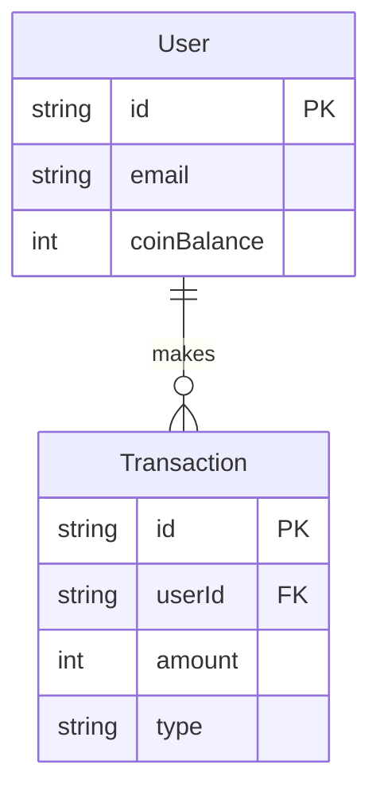

# DATABASE DIAGRAM SKILLS — Devakorn Creator AI

> Guidelines for visualizing database structures and schema changes.

---

## 1. Schema Visualization Requirement
- **Always Visualize Changes:** Whenever you propose a change to the database schema (adding tables, modifying relations, adding columns), you MUST provide a Database Diagram to the user.
- **Format:** Use **Mermaid.js** ER Diagram syntax (`erDiagram`).

## 2. Mermaid ER Diagram Rules
- **Syntax:** Ensure relationships are clearly defined (One-to-One, One-to-Many, Many-to-Many).
- **Attributes:** Include primary keys (`PK`), foreign keys (`FK`), and core data types in the diagram.
- **Clarity:** Keep the diagram focused on the tables being modified and their immediate relations. Do not render the entire database if you are only modifying one or two tables.

### Example Syntax:

## 3. Review Process
- Before executing a migration or writing ORM schema code, present the Mermaid diagram in your response.
- Wait for the user to approve the conceptual diagram before generating the actual database schema code.
